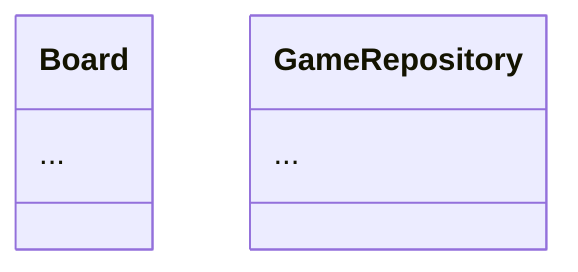

# ドキュメント管理ルール

## ドキュメントの種類と置き場所

| 種類           | 置き場所               | 目的                                       |
| -------------- | ---------------------- | ------------------------------------------ |
| 仕様 (spec)    | `docs/spec/*.md`       | What / Why - ユーザー視点での要求と振る舞い |
| 設計 (design)  | `docs/design/*.md`     | How - 技術的実現方法・モジュール構成       |
| ADR            | `docs/adr/NNNN-*.md`   | 設計判断の経緯と代替案                     |
| 仕様Issue      | GitHub Issue (`spec`)  | 仕様の議論と承認の入口                     |

## 仕様 (spec) ドキュメント

### ファイル名

- `docs/spec/<topic>.md` (例: `board-rules.md`, `game-flow.md`)

### テンプレート

```markdown
# 仕様: <タイトル>

## 概要
<このドキュメントが扱う範囲の1〜2段落>

## 用語定義
- **盤 (Board)**: 8x8 のマス目で構成されるオセロの盤面
- **石 (Stone)**: 黒(BLACK) または 白(WHITE) のいずれか

## ユースケース / シナリオ
### UC-01: ゲームを開始する
**Given** アプリ起動直後
**When** ユーザーが「新規ゲーム」を選択する
**Then** 中央4マスに初期石が配置され、黒のターンになる

## ルール / 振る舞い
1. ...
2. ...

## 制約・前提
- ...

## スコープ外
- 通信対戦 (将来検討)

## 関連
- 設計: docs/design/<topic>.md
- Issue: #NN
```

## 設計 (design) ドキュメント

### ファイル名

- `docs/design/<topic>.md` (例: `architecture-overview.md`, `board-domain-model.md`)

### テンプレート

```markdown
# 設計: <タイトル>

## 対象範囲
<このドキュメントがカバーする機能/モジュール>

## 関連仕様
- docs/spec/<topic>.md

## 全体構成
<モジュール図 / シーケンス図 (Mermaid 推奨)>



## モジュール責務
| モジュール | 責務 | 主要API |
|---|---|---|
| `domain` | ... | ... |

## データ構造
<クラス図 or データモデル>

## 主要フロー
<シーケンス図>

## 設計判断
- なぜこの方法を選んだか / 代替案

## 未決事項
- ...
```

## ADR (任意)

設計判断のうち、後から「なぜこうなった?」と問われそうなもののみ書く。

### ファイル名

- `docs/adr/0001-clean-architecture-3-layers.md` (連番 + ケバブケース)

### テンプレート

```markdown
# ADR-0001: Clean Architecture 3層構成を採用する

## ステータス
Accepted (2026-05-06)

## 背景
<なぜこの判断が必要になったか>

## 判断
<採用した方針>

## 結果
<良い点・悪い点・トレードオフ>

## 代替案
<検討して却下したもの>
```

## Mermaid 図の使い方

- **クラス図**: `classDiagram`
- **シーケンス図**: `sequenceDiagram`
- **状態遷移図**: `stateDiagram-v2`
- 図はコードブロック内に書き、GitHub上で自動レンダリングされる

## ドキュメント編集時の注意

- **仕様変更は spec から始める** — design / 実装は spec が確定してから着手する
- **spec と実装の乖離を放置しない** — 実装側を直したら spec も更新する
- **更新日と更新者は git history を信頼する** — 各ドキュメントの先頭に書かない
